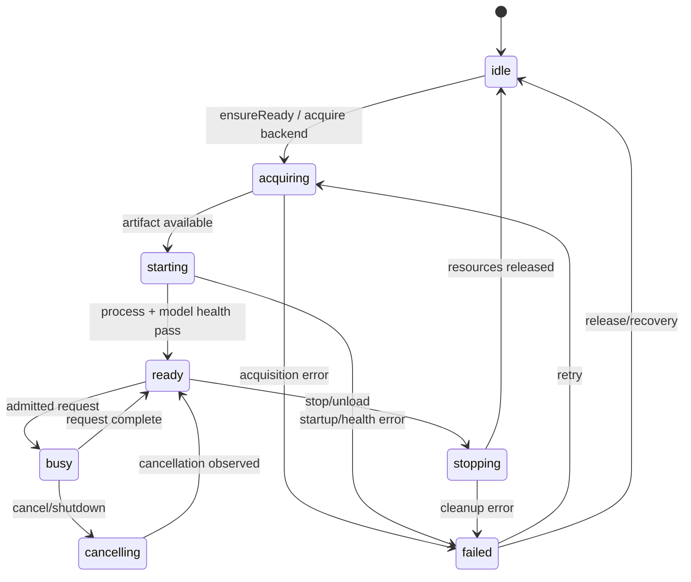
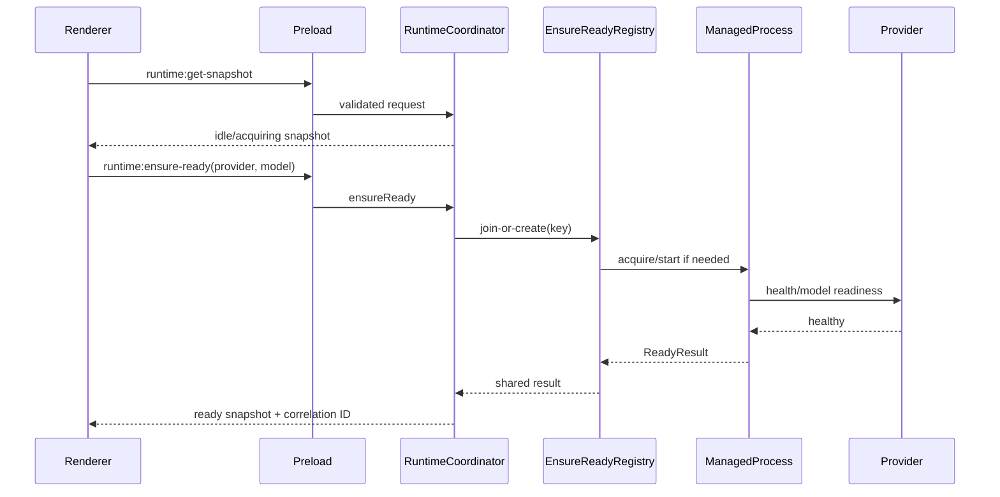
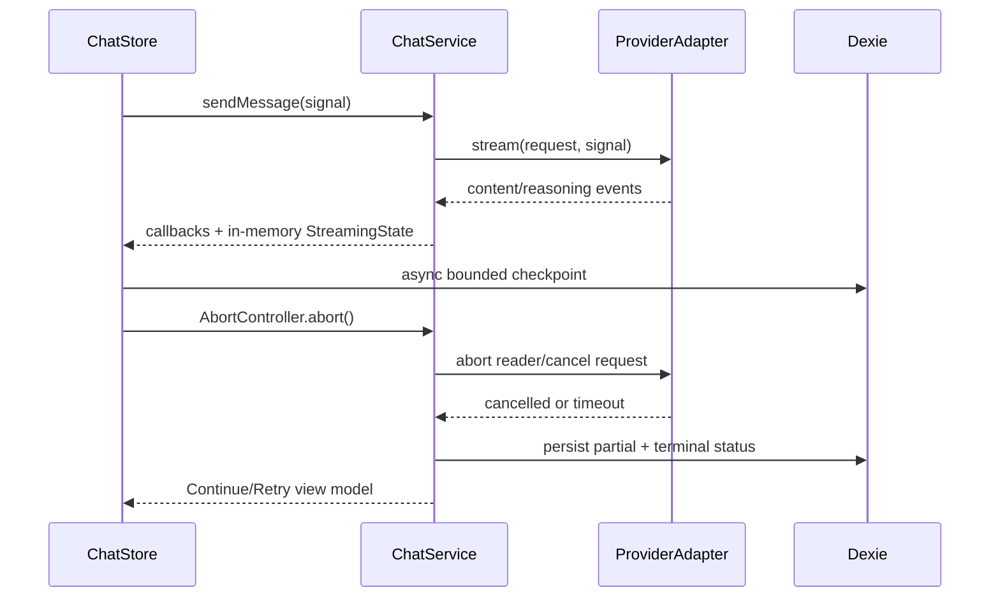

# Design: AlpacaBitOllama Runtime and UI Enhancements

## Overview

This design implements the behavior in `requirements.md` while retaining the current desktop topology: Electron main process owns backend processes, files, credentials, configuration, lifecycle, and diagnostics; `preload.js` exposes a narrow typed bridge; Svelte/SvelteKit owns presentation, interaction, conversation state, and IndexedDB persistence. The design introduces explicit domain services and contracts rather than replacing the current llama-server path.

The core phase (Requirements 1–17) is enabled by default only after its regression, security, migration, cancellation, and privacy gates pass. Phase 2 (Requirements 18–20) is compiled and tested behind feature flags but remains disabled until the Phase 1 gate is green and the user explicitly opts in where required.

The existing `ChatService` remains the renderer-facing chat API. Its current OpenAI-compatible request and SSE parsing behavior is moved behind or incrementally delegated to a provider contract, preserving `sendMessage`, reasoning/tool callbacks, `AbortSignal`, model selection, and current conversation APIs. The existing `RequestQueue`, `api-server.js`, `preload.js`, `DatabaseService`, `ChatStore`, `ChatScreen`, and `ModelsSelector` are integration points, not replacements.

Research informing this design:
- llama.cpp documents an OpenAI-compatible REST surface for its server ([llama.cpp REST API overview](https://ggml-org-llama-cpp.mintlify.app/api/rest/overview)); the design uses that compatibility as the `LlamaServerProvider` wire contract, not as a reason to copy another runtime.
- Electron recommends context isolation and a deliberately small `contextBridge` API ([context isolation](https://www.electronjs.org/docs/tutorial/context-isolation)); Electron `safeStorage` is used when its platform secret store is available ([safeStorage](https://www.electronjs.org/docs/latest/api/safe-storage)).
- GGUF is a typed binary container with model metadata ([GGUF specification](https://github.com/ggml-org/ggml/blob/master/docs/gguf.md)); the catalog preserves recognized fields and explicit unknown/malformed states.
- SSE is a one-way event stream and `AbortSignal` can abort fetch and stream consumption ([SSE](https://developer.mozilla.org/en-US/docs/Web/API/Server-sent_events/Using_server-sent_events), [AbortSignal](https://developer.mozilla.org/en-US/docs/Web/API/AbortSignal)); the stream reducer is built around those semantics.
- Node's `crypto` module supplies hash/signature primitives ([Node crypto](https://nodejs.org/api/crypto.html)); artifact identity uses a streamed digest rather than loading whole models into memory.
- Dexie supports versioned stores and upgrade functions ([Dexie upgrades](https://dexie.org/docs/Version/Version.upgrade)); conversation and streaming migrations follow that model.

Content from these sources was rephrased for compliance with licensing restrictions; links identify the original documentation.

### Goals

1. Make runtime lifecycle and readiness observable and race-safe.
2. Normalize local, curated, and future provider/model behavior without changing the chat contract.
3. Prevent unsafe execution, secret leakage, unbounded memory use, and lost partial responses.
4. Provide implementation boundaries that can be delivered incrementally and tested at pure, integration, and browser boundaries.
5. Preserve current single-model mode, router mode, curated downloads, local history, preload authorization, and local-first privacy.

### Non-goals

This is not a wholesale adoption of AnythingLLM, Ollama, llama-optimus, or Bionic. Their behavioral ideas—bounded scheduling, provider abstraction, model discovery, and fit guidance—are adapted to a single-user Electron desktop process. No server-admin architecture, hosted control plane, or mandatory remote telemetry is introduced.

## Architecture

### Process and module boundaries

```mermaid
flowchart LR
  UI[Svelte/SvelteKit Renderer]\n  Stores[ChatStore / ModelsStore / RuntimeStore]\n  Bridge[Typed Preload Bridge]\n  Main[Electron Main RuntimeCoordinator]
  Lifecycle[ManagedProcess + RuntimeStateMachine]
  Providers[ProviderRegistry + LlamaServerProvider]
  Catalog[ModelCatalog + GGUFInspector + DiscoveryCache]
  Scheduler[AdmissionScheduler + CircuitBreakers]
  Verify[ArtifactVerifier + SafeExtractor]
  Config[VersionedConfigStore + CredentialStore]
  Diagnostics[DiagnosticsService + Redaction + Export]
  DB[(Dexie IndexedDB)]
  Disk[(App data / models / logs)]
  Backend[llama-server process]
  Remote[Optional explicitly configured provider/discovery]

  UI --> Stores --> Bridge --> Main
  Stores --> DB
  Main --> Lifecycle --> Backend
  Main --> Providers --> Backend
  Main --> Providers --> Remote
  Main --> Catalog --> Disk
  Main --> Verify --> Disk
  Main --> Scheduler --> Providers
  Main --> Config --> Disk
  Main --> Diagnostics --> Disk
  Main --> UI
```

**Electron main process.** `RuntimeCoordinator` is the only owner of mutable runtime lifecycle and model-load mutations. It composes `ManagedProcess`, `RuntimeStateMachine`, `EnsureReadyRegistry`, `AdmissionScheduler`, `ProviderRegistry`, `ModelCatalog`, `ArtifactVerifier`, `ConfigMigrator`, and `DiagnosticsService`. Existing `main.js` IPC handlers delegate to this coordinator instead of directly manipulating process state.

**ManagedProcess.** A small process supervisor wraps spawn, stdout/stderr capture, health polling, graceful termination, forced termination, ownership tokens, and exit classification. It never accepts renderer-provided executable paths or arbitrary arguments. Backend selection comes from the curated binary manager and validated configuration.

**Renderer.** `RuntimeStore` subscribes to snapshots/events and derives readiness actions. `ModelsStore` consumes normalized catalog records. `ChatStore` continues to own conversation-level streaming state and delegates provider calls through `ChatService`. `DatabaseService` remains the Dexie boundary.

**HTTP API.** The local API stays loopback by default. Existing `api-server.js` configuration is migrated into a versioned shape. The provider layer may call the local llama-server endpoint directly, while renderer requests continue through the existing relative `/v1` path where applicable. A future main-process scheduler can coordinate provider calls without exposing process controls to the renderer.

### Runtime state machine

The public states are exactly `idle`, `acquiring`, `starting`, `ready`, `busy`, `stopping`, `failed`, and `cancelling`. Internal substates (for example, `healthChecking`) are represented as operation metadata, not additional public states. Every transition includes `{from, to, reasonCode, correlationId, at, progress?, cancellable}`.



The state machine validates transitions from an explicit adjacency table. Invalid transitions do not mutate state and emit one redacted diagnostic. The coordinator owns a monotonically increasing operation epoch; stale completions cannot commit a state transition after a newer stop, replacement, or retry.

### Race-safe EnsureReady

`EnsureReadyRegistry` keys operations by `{providerId, modelIdentity}` and stores one shared operation record:

```ts
interface EnsureReadyOperation {
  key: string;
  epoch: number;
  promise: Promise<ReadyResult>;
  callers: Map<string, { signal?: AbortSignal; detached: boolean }>;
  cancellation: AbortController;
  cancellable: boolean;
}
```

A request for the same key joins the existing promise. Each caller receives a derived promise that rejects with `CallerCancelledError` when its signal aborts, without cancelling shared work. The shared operation is cancelled only when its caller set becomes empty, the current step is safely cancellable, and the coordinator has not committed a non-cancellable process mutation. Requests for different models enter a FIFO mutation lane; readiness checks may be parallel only when they do not mutate the one local server. A per-server mutex guarantees at most one model-load mutation.

Failure cleanup is ordered: stop admission, cancel safe acquisition, terminate/release partial process resources, invalidate stale model handles, emit a redacted typed error, then commit `failed`. Retrying creates a new epoch. Equivalent callers receive the same normalized `ReadyResult` value, including provider/model identity, digest, state, and diagnostics correlation ID.

### Provider architecture

`ProviderContract` is a TypeScript-shape contract shared by main-process adapters and renderer types:

```ts
interface ProviderAdapter {
  descriptor(): ProviderDescriptor;
  listModels(signal?: AbortSignal): Promise<ModelPage | ProviderError>;
  ensureReady(model: ModelRef, signal?: AbortSignal): Promise<ReadyResult | ProviderError>;
  health(signal?: AbortSignal): Promise<HealthStatus | ProviderError>;
  chat(request: NormalizedChatRequest, signal?: AbortSignal): Promise<NormalizedResponse | ProviderError>;
  stream(request: NormalizedChatRequest, onEvent: StreamSink, signal?: AbortSignal): Promise<StreamResult | ProviderError>;
  cancel(requestId: string): Promise<void>;
  capabilities(): ProviderCapabilities;
}
```

`LlamaServerProvider` is Phase 1 and wraps the current local llama-server endpoint, model switching, `/health`, `/models`, `/slots`, and OpenAI-compatible chat completions. It preserves current parameter names and reasoning/tool event behavior. The adapter converts HTTP status, malformed payload, connection, timeout, and cancellation outcomes into the common error taxonomy.

Phase 2 adapters (`OpenAICompatibleProvider`, `OllamaProvider`, `LMStudioProvider`) share a transport and normalization layer but remain disabled until Phase 1. Each declares endpoint origin, transport, authentication mode, model discovery support, cancellation strategy, streaming dialect, and privacy characteristics. They must pass the same mocked contract suite as `LlamaServerProvider`; provider-specific features are capability-gated rather than silently approximated.

### Model catalog and discovery

`ModelCatalog` merges sources into a normalized immutable snapshot:

1. installed local GGUF files;
2. curated download manifest and download progress records;
3. current router/provider model listings;
4. explicitly enabled discovery sources and bounded cache pages.

A source merge never deletes a previously verified record solely because a source is unavailable. It marks the record/source `stale`, records the source failure, and keeps the last verified digest and metadata. Catalog updates are versioned snapshots with deterministic sorting by provider group, display name, digest, and stable ID.

`GGUFInspector` reads the header and typed key/value metadata through a bounded streaming reader. Recognized metadata is retained as typed values. Missing values are `unknown`; invalid type/length/encoding is `malformed`; malformed metadata does not discard the model record. Unrecognized fields are retained in a bounded `extensions` map when safe. Parsing is isolated from model loading.

The canonical content identity is `digest:{algorithm}:{hex}` after a verified digest exists. Before verification, a record has a provisional source identity and cannot be marked available for execution. Equal verified digests collapse content identity while retaining source/path aliases. Different verified digests always remain distinct. Curated manifests supply expected digest/signature and display metadata; Hugging Face or other discovery is opt-in, paginated, cancellable, source-attributed, and cached with an expiry and bounded result count.

### Hardware and fit planning

`HardwareSnapshot` is collected in the main process and includes CPU topology, accelerator/vendor/driver when available, usable memory bytes, OS identity, runtime/backend capabilities, and confidence (`known`, `partial`, `unknown`). Raw probing failures are normalized and never block local chat.

`FitPlanEvaluator` is deterministic and non-mutating. It uses conservative estimates:

- weight bytes: artifact size or quantization-aware estimate;
- runtime overhead: fixed model-architecture and backend safety margin;
- KV cache: context length × layer/head/element-size estimate, with a conservative multiplier when metadata is incomplete;
- offload plan: CPU/GPU split only when the backend advertises the relevant offload capability;
- available budget: usable memory × configurable safety fraction, never total physical memory;
- context recommendation: the largest safe context below the model limit and budget, or `unknown` when required inputs are missing.

Statuses are `fits`, `tight`, `does-not-fit`, and `unknown`. `unknown` never becomes a positive fit claim. Explanations list assumptions, estimated bytes, unavailable inputs, and alternatives from the catalog. Phase 2 calibration may benchmark explicitly selected local models in a bounded background job; it stores summary throughput/latency keyed by `ModelDigest` and `HardwareSnapshot` identity only, with pause/cancel/resource limits and opt-out. It never uploads prompts or generated content.

### Scheduling and memory recovery

`AdmissionScheduler` wraps the current `RequestQueue` behavior with typed records and explicit counters: active, queued, rejected, cancelled, completed, failed, and capacity. Admission first checks provider circuit state, fit/readiness, queue capacity, and shutdown/replacement state. Each admitted request obtains exactly one terminal outcome.

Every loaded model handle has a reference count. Reservations occur before inference and release in a `finally` path. Idle unload is eligible only when the inactivity deadline has passed, reference count is zero, no active stream exists, and no EnsureReady mutation owns the handle. Catalog records and Dexie conversations are never evicted with model resources.

When capacity is needed, deterministic eviction sorts only eligible idle models by least recently used time, then digest identity as a stable tie-breaker. Active, reserved, pinned, currently selected, or failing-recovery models are not evicted. Every eviction emits a reason and resource snapshot.

Recognized OOM errors enter `ControlledOomRecovery` once: capture original error, release only eligible idle resources or choose an explicitly configured fallback fit plan, retry once, then return a typed result containing original and recovery outcomes. Non-OOM failures never trigger this path. The scheduler has one model-load lane, nonnegative references, bounded queues, and injected time for deterministic tests.

### Circuit breaker

Circuit state is keyed by provider identity and operation category (`health`, `model-load`, `chat`, `stream`, `discovery`). States are `CLOSED`, `OPEN`, and `HALF_OPEN`, with configurable threshold and reset time. Caller cancellation is not a failure. An open circuit rejects eligible new work with `CircuitOpenError`; one half-open probe is admitted, success closes and resets, failure reopens. Status includes consecutive failures, reset deadline, and last safe correlation ID, never request content.

### Streaming and persistence

The normalized stream event union is:

```ts
type StreamEvent =
  | { kind: 'content'; text: string }
  | { kind: 'reasoning'; text: string }
  | { kind: 'tool-progress'; payload: SafeToolProgress }
  | { kind: 'heartbeat'; at: number }
  | { kind: 'model'; id: string }
  | { kind: 'timings'; value: SafeTimings }
  | { kind: 'complete'; finishReason?: string }
  | { kind: 'cancelled' }
  | { kind: 'error'; error: ProviderError };
```

`StreamReducer` parses SSE data lines, ignores comments/heartbeats as content, validates JSON shape, and applies provider-specific normalization. A malformed event is either skipped as recoverable or terminates the stream according to the adapter protocol. It emits one redacted protocol diagnostic per correlation/event boundary and never forwards malformed content. Completion is idempotent and emitted at most once. Cancellation is a terminal cancelled outcome, not a backend failure.

`AbortSignal` is passed from `ChatStore` through `ChatService` to the provider transport. The provider aborts fetch/body reading and invokes backend cancellation where supported. The target is observation and stream termination within two seconds; tests use controlled readers and a deadline rather than sleeping in unit tests.

Heartbeat timeout is configurable, uses activity from content, reasoning, tool-progress, timing, or heartbeat events, and persists available partial output before returning `StreamHeartbeatTimeoutError`. Metrics record duration, time to first output, token count when provided, cancellation, provider, model, and correlation ID; content and per-token content are excluded by default.

`StreamingState` is keyed by `{conversationId, requestId}` and includes content, reasoning content, message ID, model/digest, checkpoint sequence, started/last activity times, and terminal status. `ChatStore` keeps the fast in-memory view; `DatabaseService` persists bounded checkpoints asynchronously through a new Dexie table. Final completion updates the existing message. Cancellation persists partial content with `cancelled`; restart recovery changes active states to `interrupted`, never `completed`. Continue and Retry actions are derived from terminal reason. Context overflow retains token measurements and offers context reduction/retry without deleting history.

### Artifact verification and safe extraction

`ArtifactVerifier` streams SHA-256 (or a configured supported algorithm) over backend/model bytes before availability. A trusted manifest digest or signature is checked before execution/load. Reused artifacts are revalidated according to policy (`always`, `on-manifest-change`, or `never` only for explicitly non-executable metadata). Verification failure quarantines to an application-owned quarantine directory or removes the incomplete file, and returns a safe recovery action.

`SafeExtractor` resolves every archive entry against the intended application-data root using normalized paths, rejects absolute paths, drive prefixes, symlink escapes, `..` traversal, and oversized/compressed-bomb estimates, and writes with exclusive temporary names before atomic rename. Renderer inputs never choose extraction roots or executable paths.

### Configuration, API, CORS, and security

`VersionedConfigStore` wraps electron-store with schema version, validated defaults, ordered migrations, backup-before-write, and atomic replacement. Existing `apiServer` values map into the new runtime/API section without losing unknown settings. Invalid values retain the original raw value in a backup/recovery record, apply a documented safe default only to the affected field, and emit a migration warning. Migration is idempotent.

`api-server.js` defaults remain loopback (`127.0.0.1`). Non-loopback binding requires an explicit confirmation stored separately from ordinary settings. CORS accepts an explicit allowlist; wildcard origins are rejected when credentials/API-key protection is enabled. API keys are compared in main process, never passed into renderer state, logs, URLs, diagnostics, or user-facing error text.

`CredentialStore` uses Electron `safeStorage` when available and reports only `{configured, storage: 'secure'|'fallback', providerId}` to the renderer. If secure storage is unavailable, the user receives a clear local-risk warning and must explicitly accept the fallback. Remote non-loopback HTTP endpoints require confirmation describing transport and credential risks.

`preload.js` is converted incrementally to typed wrappers over a channel registry. Each operation has a schema (zod or a small equivalent validator), maximum payload size, and result type. Unknown channels, invalid argument shapes, renderer filesystem paths, process commands, executable paths, and arbitrary IPC event names are rejected. Event subscriptions return unsubscribe handles and are cleaned up on renderer destruction. Main-process handlers revalidate all bridge arguments; preload validation is not the sole security boundary.

### Diagnostics and privacy

`DiagnosticsService` produces `{timestamp, severity, subsystem, operation, correlationId, runtimeState, providerId?, modelDigest?, metrics?, error?}`. `Redactor` runs before persistence, event emission, renderer projection, and export. It removes API keys, authorization headers, private keys, credential-bearing URLs, home-directory-sensitive paths where configured, message content, attachment data, and prompt/token text.

The health view projects readiness, active model identity, queue counts, provider/circuit status, artifact verification, and latest safe error/retry action. Export includes configuration shape (not values marked secret), hardware summary, lifecycle history, queue metrics, and relevant errors. It excludes conversations and secrets by default. Diagnostics storage is bounded by count and bytes; oldest eligible diagnostic records are removed without touching Dexie conversation tables. Metrics-disabled mode omits content and per-token content metrics rather than persisting them elsewhere.

## Components and Interfaces

### Proposed main-process modules

| Module | Responsibility | Existing integration |
|---|---|---|
| `desktop/runtime/runtime-coordinator.js` | Compose services, own epochs, snapshots, IPC-facing commands | `main.js`, `lazy-start-manager.js` |
| `desktop/runtime/runtime-state-machine.js` | State adjacency, reasons, history, transition validation | `main.js`, splash/status handlers |
| `desktop/runtime/managed-process.js` | Spawn/health/stop/exit/resource ownership | `binary-manager.js`, existing server startup |
| `desktop/runtime/ensure-ready-registry.js` | Shared readiness promises, caller detachment, mutation lane | model switch/start handlers |
| `desktop/providers/provider-contract.js` | Runtime types/constants/error normalization | new and existing providers |
| `desktop/providers/llama-server-provider.js` | Local llama-server adapter | `api-server.js`, current HTTP routes |
| `desktop/providers/provider-registry.js` | Provider registration and Phase 2 gating | credential handlers |
| `desktop/catalog/model-catalog.js` | Source merge, stale records, identity index | installed/router/HF model handlers |
| `desktop/catalog/gguf-inspector.js` | Bounded GGUF metadata inspection | model download/selection |
| `desktop/catalog/discovery-cache.js` | Opt-in bounded discovery cache | Hugging Face IPC |
| `desktop/planning/hardware-snapshot.js` | Detection and confidence | existing hardware IPC |
| `desktop/planning/fit-plan.js` | Conservative deterministic estimates | model selection/readiness |
| `desktop/scheduling/admission-scheduler.js` | Queue, references, unload, eviction, OOM recovery | `request-manager.js` |
| `desktop/security/artifact-verifier.js` | Digest/signature/reuse verification | `binary-manager.js`, download handlers |
| `desktop/security/safe-extractor.js` | Archive path and size safety | download handlers |
| `desktop/config/versioned-config-store.js` | electron-store schema/migrations/backups | `api-server.js`, settings handlers |
| `desktop/security/credential-store.js` | safeStorage and redacted status | provider credential IPC |
| `desktop/diagnostics/diagnostics-service.js` | Records, retention, redaction, export | logs viewer and health IPC |
| `desktop/feature-gates.js` | Phase 1 exit and Phase 2 flags | runtime startup and UI projection |

### Proposed WebUI modules

| Module | Responsibility | Existing integration |
|---|---|---|
| `webui/src/lib/types/runtime.ts` | Runtime/provider/catalog/stream/error types | stores/services |
| `webui/src/lib/services/provider.service.ts` | Typed provider bridge/HTTP façade | `ChatService` |
| `webui/src/lib/services/runtime.service.ts` | Snapshot, readiness, cancellation, diagnostics calls | preload API |
| `webui/src/lib/stores/runtime.svelte.ts` | Runtime snapshots and action view model | `ChatScreen` |
| `webui/src/lib/stores/streaming.svelte.ts` | Conversation/request streaming recovery state | `ChatStore`, `DatabaseService` |
| `webui/src/lib/components/app/runtime/ReadinessPanel.svelte` | State, progress, exactly-one-action onboarding | `ChatScreen` |
| `webui/src/lib/components/app/runtime/HealthView.svelte` | Safe health and diagnostics display | settings/diagnostics route |
| `webui/src/lib/components/app/models/ProviderGroup.svelte` | Grouped provider/model rendering | `ModelsSelector.svelte` |
| `webui/src/lib/components/app/chat/ConversationRecovery.svelte` | Interrupted/cancelled/overflow actions | `ChatScreen` |
| `webui/src/lib/utils/stream-reducer.ts` | Pure normalized stream reducer | `ChatService` |
| `webui/src/lib/utils/redaction.ts` | Renderer-side defensive redaction | diagnostics projection |

### IPC and HTTP contracts

All IPC responses use `{success: true, data}` or `{success: false, error: RedactedError}` and include a correlation ID for asynchronous operations. Representative channels:

- `runtime:get-snapshot`, `runtime:ensure-ready`, `runtime:cancel-operation`, `runtime:stop`, `runtime:on-event`;
- `catalog:list`, `catalog:refresh`, `catalog:inspect`, `catalog:discover` (Phase 2 gated);
- `provider:list`, `provider:health`, `provider:set-credential`, `provider:delete-credential`;
- `diagnostics:get-health`, `diagnostics:export`, `diagnostics:get-events`;
- `artifacts:verify`, `artifacts:download`, `artifacts:cancel`;
- `scheduler:get-status`.

The existing channels (`get-server-status`, `start-server`, `stop-server`, `switch-model`, `get-installed-models`, API settings, hardware, download progress, and provider credentials) remain as compatibility aliases backed by the coordinator. No existing renderer operation is renamed without a migration path.

Normalized chat requests contain request ID, model reference, messages, generation parameters, tools, stream flag, and capability requirements. Messages are transformed in `ChatService`; the main process/provider receives only the request necessary for configured inference. Normalized responses preserve current content, reasoning, tool calls, model, timings, and context information.

## Data Models

```ts
interface ModelRecord {
  id: string;                 // stable catalog identity
  displayName: string;
  providerId: string;
  providerGroupId: string;
  source: 'local'|'curated'|'router'|'discovery';
  format: 'gguf'|'remote'|'unknown';
  reference: string;          // path or remote model reference, redacted in diagnostics
  digest?: { algorithm: string; value: string; verified: boolean };
  capabilities: string[];
  contextLimit?: number;
  sizeBytes?: number;
  availability: 'available'|'unavailable'|'stale';
  verification: 'verified'|'pending'|'failed'|'unknown';
  metadata: Record<string, unknown>;
  metadataStatus: Record<string, 'known'|'unknown'|'malformed'>;
  lastSeenAt: number;
}

interface HardwareSnapshot {
  cpu: { logicalCores?: number; architecture?: string; model?: string };
  accelerator?: { vendor?: string; name?: string; memoryBytes?: number; driver?: string };
  usableMemoryBytes?: number;
  os: { platform: string; release?: string; arch: string };
  confidence: 'known'|'partial'|'unknown';
  capturedAt: number;
}

interface FitPlan {
  modelId: string;
  status: 'fits'|'tight'|'does-not-fit'|'unknown';
  estimated: { weightsBytes?: number; kvCacheBytes?: number; overheadBytes?: number; totalBytes?: number };
  allocation?: { contextTokens?: number; gpuOffloadLayers?: number; cpuBytes?: number; acceleratorBytes?: number };
  assumptions: string[];
  explanation: string;
  alternatives: string[];
}

interface RuntimeSnapshot {
  state: RuntimeState;
  reason: TransitionReason;
  provider?: ProviderStatus;
  model?: { id: string; digest?: string; fit?: FitPlan };
  operation?: { id: string; progress?: number; cancellable: boolean };
  queue: QueueStatus;
  circuit: CircuitStatus[];
  phase: { phase1Exit: 'pending'|'passed'|'failed'; phase2Enabled: boolean };
}

interface StreamingState {
  conversationId: string;
  requestId: string;
  messageId: string;
  content: string;
  reasoningContent: string;
  modelId?: string;
  checkpointSequence: number;
  startedAt: number;
  lastActivityAt: number;
  terminalStatus: 'active'|'completed'|'cancelled'|'failed'|'interrupted';
  failure?: RedactedError;
}
```

Dexie migration adds `streamingStates` keyed by `[conversationId+requestId]` and `diagnosticMetadata` only if needed for renderer recovery; existing `conversations` and `messages` fields are preserved. Migration copies existing records, never rewrites message IDs/order/branches/attachments/model references/timestamps, and marks incomplete streams interrupted after restart. Each migration has a schema version, bounded operation, fixture, and rollback/recovery path.

### Error taxonomy

Errors are serializable and safe by construction:

- `InvalidTransitionError` — attempted state transition and valid alternatives;
- `EnsureReadyError` — operation stage, retryability, remediation, correlation ID;
- `ProviderUnsupportedCapabilityError` — provider/capability/requested operation;
- `ProviderUnavailableError`, `ProviderProtocolError`, `ProviderAuthError`, `ProviderTimeoutError`;
- `CallerCancelledError`, `ShutdownError`, `ReplacementError`, `CapacityError`, `CircuitOpenError`;
- `FitUnknownError`, `FitInsufficientError`;
- `ArtifactDigestMismatchError`, `ArtifactSignatureError`, `UnsafeArchiveError`;
- `ConfigMigrationError`, `RecoveryModeError`;
- `StreamHeartbeatTimeoutError`, `StreamMalformedEventError`, `ContextOverflowError`.

Every error has `code`, safe `message`, `retryable`, `recoveryAction`, `correlationId`, and optional non-secret details. Raw causes remain main-process-only and are never serialized to the renderer.

## Correctness Properties

*A property is a characteristic or behavior that should hold true across all valid executions of a system—essentially, a formal statement about what the system should do. Properties serve as the bridge between human-readable specifications and machine-verifiable correctness guarantees.*

Reflection on properties: the prework identified many testable criteria, but several are subsumed by shared invariants. The properties below consolidate redundant criteria: lifecycle transition and one-active-operation rules are combined; queue/circuit accounting shares a reference-model property; stream callback, malformed-event, heartbeat, and cancellation rules share reducer invariants; catalog identity and serialization are separate because identity equality and round-trip fidelity provide different validation value. UI visual/accessibility criteria remain example/browser tests rather than PBT.

### Property 1: Lifecycle transition and operation safety

For all generated lifecycle event sequences, the runtime SHALL accept only permitted transitions, preserve the previous state on invalid transitions, maintain at most one active acquisition/start or model-load mutation, and emit a safe diagnostic for every rejected transition.

**Validates: Requirements 1.1, 1.3, 1.5, 2.5, 6.7**

### Property 2: EnsureReady coalescing and cancellation isolation

For any generated set of concurrent EnsureReady callers, callers targeting the same provider/model SHALL share exactly one readiness operation, non-cancelled callers SHALL receive equivalent results, and cancellation of one caller SHALL not cancel shared work while another caller remains.

**Validates: Requirements 2.1, 2.2, 2.3**

### Property 3: Provider normalization and capability refusal

For all generated common requests and provider capability sets, an adapter SHALL either produce the normalized response/error shape or return a typed unsupported-capability result without attempting an incompatible operation; equivalent wire responses SHALL normalize equivalently.

**Validates: Requirements 3.1, 3.3, 3.5, 18.1, 18.6**

### Property 4: Provider error redaction

For any provider error containing arbitrary credential, authorization, private-path, URL, or message-content patterns, normalization SHALL retain provider/operation/retryability/correlation fields while emitting no secret or unapproved content.

**Validates: Requirements 3.4, 10.3, 10.7, 12.1, 12.6**

### Property 5: Catalog identity and serialization round trip

For all valid normalized Model_Record values, serialization followed by deserialization SHALL preserve identity, source, capabilities, verification status, and digest semantics; artifacts with equal verified digests SHALL share content identity, while artifacts with different verified digests SHALL remain distinct.

**Validates: Requirements 4.3, 4.4, 4.6**

### Property 6: GGUF and catalog failure tolerance

For any generated recognized, absent, malformed, or unavailable catalog metadata/source result, the catalog SHALL retain the Model_Record, assign explicit metadata status, and preserve previously verified records as stale rather than deleting them.

**Validates: Requirements 4.2, 4.5, 18.3**

### Property 7: Deterministic conservative fit planning

For all supported Model_Record and HardwareSnapshot inputs, the fit evaluator SHALL return the same plan on repeated calls without mutating either input; when required hardware data is missing it SHALL not claim a positive fit.

**Validates: Requirements 5.2, 5.3, 5.5**

### Property 8: Admission and queue accounting

For all generated admission, queue, completion, failure, cancellation, clear, and reset sequences, the scheduler SHALL respect concurrency and queue bounds, reject over-capacity work without altering admitted work, classify cancellation separately, and keep counters, latency summaries, and circuit state consistent.

**Validates: Requirements 6.1, 6.2, 7.1, 7.2, 7.4, 7.5, 7.6**

### Property 9: Reference-counted deterministic recovery

For all generated model resource and request sequences, reference counts SHALL never become negative, nonzero references SHALL prevent idle unload, eviction SHALL select only eligible victims deterministically, and a recognized OOM request SHALL perform no more than one controlled retry while preserving both outcomes.

**Validates: Requirements 6.3, 6.4, 6.5, 6.6, 6.7, 20.5**

### Property 10: Circuit breaker state machine

For all provider/category failure and fake-clock sequences, a circuit SHALL open exactly at its configured threshold, reject eligible work during the reset interval, admit at most one half-open probe, and close/reset after a successful probe without coupling keys.

**Validates: Requirements 7.1, 7.2, 7.3**

### Property 11: Stream reducer safety

For any generated ordered, repeated, reordered, recoverable-malformed, terminal-malformed, heartbeat, content, reasoning, tool, cancellation, and completion event sequence, the reducer SHALL preserve valid aggregate content, skip malformed content, emit at most one completion, order callbacks consistently, and never classify caller cancellation as backend failure.

**Validates: Requirements 8.2, 8.5, 8.6**

### Property 12: Stream timeout and metric privacy

For all generated activity gaps and partial outputs, a heartbeat timeout SHALL produce a typed timeout and checkpoint request; all generated metrics SHALL contain timing/count/status/provider/model metadata only and no message content when content metrics are disabled.

**Validates: Requirements 8.3, 8.4, 12.4**

### Property 13: Artifact identity and path safety

For all byte sequences and archive entry paths, digest computation SHALL be deterministic, any changed byte sequence SHALL produce a different verified identity, and only entries contained within the intended extraction root SHALL be accepted.

**Validates: Requirements 9.5, 9.6**

### Property 14: Security policy validation

For all generated bind, CORS, credential, endpoint-transport, API-key, and preload channel/argument combinations, policy validation SHALL require explicit confirmation for non-loopback/insecure cases, reject credentialed wildcard CORS, and reject unknown or malformed bridge operations.

**Validates: Requirements 10.1, 10.2, 10.4, 10.6**

### Property 15: Configuration migration idempotence

For all supported legacy and current configuration fixtures, migration SHALL be bounded, ordered, and idempotent; valid semantics and unrepresented settings SHALL be preserved, while unsafe values SHALL receive documented safe defaults and warnings without silently discarding the original.

**Validates: Requirements 11.1, 11.2, 11.3, 11.6, 16.4**

### Property 16: Privacy-safe diagnostics projection

For all generated diagnostics, configuration shapes, hardware summaries, and error records, persistence/export projection SHALL redact secrets and message content, retain required operational fields, and enforce bounded retention without touching conversation history.

**Validates: Requirements 12.1, 12.3, 12.5, 12.6**

### Property 17: Streaming state isolation and round trip

For all generated interleaved Streaming_State values across conversations, serializer/restorer round trips SHALL preserve content, reasoning, request identity, and terminal status, and restoration SHALL never associate a partial response with another conversation.

**Validates: Requirements 13.1, 13.2, 13.7**

### Property 18: Model selection determinism and readiness actions

For all generated equivalent catalog orderings, search terms, runtime states, readiness outcomes, and selection attempts, model identity SHALL occur once, selection SHALL be deterministic, the previous selection SHALL remain until acceptance/cancellation, and the readiness view model SHALL expose only valid actions with exactly one primary action.

**Validates: Requirements 14.1, 14.3, 14.4, 14.6, 15.1, 15.2, 15.3**

### Property 19: Phase gates and optional complexity

For all generated Phase 1 gate results and capability cost assessments, Phase 2 adapters, discovery, calibration, organization, and routing SHALL remain disabled unless the gate and explicit opt-in conditions pass; capabilities exceeding declared resource/privacy/complexity bounds SHALL expose disable or rollback behavior.

**Validates: Requirements 18.5, 19.1, 19.2, 19.6, 20.1, 20.3, 20.6**

### PBT implementation convention

Use the existing Vitest unit project with a maintained property-testing library (for example, `fast-check`, pinned in `webui/package.json` when implementation begins). Do not implement generators/shrinkers from scratch. Each property gets one property-based test with at least 100 runs and a comment of the form `Feature: alpacabitollama-runtime-and-ui-enhancements, Property N: <property text>`. Pure main-process JavaScript logic may use the project’s Node test harness or a shared test runner, but must use the same generated model/reference fixtures where possible.

## Error Handling

Errors follow a fail-closed, preserve-user-data policy. Process failures stop admission, release owned resources, and expose Retry/Diagnostics or Select another model. Provider failures are normalized and circuit-counted unless cancellation or shutdown caused them. Unknown hardware yields an unknown fit plan, not an optimistic load. Verification failure blocks execution. Migration failure enters recovery mode with export/reset actions; reset is never automatic.

The renderer never displays raw stack traces, headers, paths, URLs with credentials, or backend output classified as a secret. It displays a short safe message, retryability, one primary recovery action, and optional diagnostics. All asynchronous operations have a timeout or cancellation path. Cleanup is idempotent and runs on application shutdown, provider replacement, renderer destruction, and failed startup.

## Testing Strategy

### Unit and property suites

- Runtime state machine: transition table, epochs, stale completion rejection, reasons.
- EnsureReady: shared promise, caller cancellation, different-model serialization, no duplicate load.
- Provider: capability negotiation, response/error normalization, redaction, stream reducer.
- Catalog/GGUF: metadata parsing, stale merge, digest identity, serializer round trip.
- Fit: conservative estimates, unknown inputs, deterministic non-mutation.
- Scheduler: queue reference model, circuit breaker, references, eviction, OOM retry.
- Security: archive path validation, digest/signature policy, CORS/API-key/preload validation.
- Migration: configuration fixtures, idempotence, unknown setting retention, streaming state round trip.

PBT properties use at least 100 iterations. Example tests cover boundary errors, exact state/action mappings, known GGUF fixtures, trusted/tampered artifacts, and representative provider payloads.

### Integration and browser suites

Use controlled process fixtures rather than real long-running servers for most tests. Cover startup/readiness gating, model switch, queue saturation, cancellation deadline, health failures, OOM recovery, digest quarantine, secure-storage available/unavailable, config recovery, Dexie migration, and local-only network capture. Browser-level Playwright tests cover readiness/onboarding, model selector search/keyboard/disabled historical values, conversation switching during stream, checkpoint recovery, context overflow, reduced motion, accessible names, focus restoration, and optional split-panel fallback.

### Release gates

Phase 1 must pass the backward-compatibility fixtures for current single-model mode, curated downloads, router mode, IndexedDB history, streaming, cancellation, and preload authorization; all security/privacy tests; migration tests; and core unit/integration/browser/PBT suites. A failure leaves Phase 2 disabled and is surfaced in diagnostics/release output. Phase 2 adds adapter parity, opt-in discovery, remote-provider disclosure, calibration privacy, organization IDs, split-layout accessibility, and routing invariants.

## Performance and Resource Limits

- One local model-load mutation at a time; readiness joiners do not multiply process work.
- Default queue and concurrency inherit current settings, but queue length and request body sizes are bounded and configurable.
- Stream checkpoint cadence is time- and byte-bounded; writes are asynchronous and coalesced per conversation/request.
- Diagnostics are bounded by count and byte budget; exports are size-limited and streamed to disk.
- GGUF inspection reads only headers/metadata and has maximum metadata key/value and string lengths.
- Discovery is opt-in, paginated, cancellable, cache-expiring, and bounded in result count.
- Artifact hashing/extraction streams bytes and enforces maximum artifact, archive, entry, and expansion sizes.
- Fit planning uses safety margins and never allocates based solely on total physical memory.
- Calibration is background, pauseable, cancellation-aware, and resource-limited; it is never enabled implicitly.

## Lifecycle Sequences

### Startup and readiness



### Streaming cancellation and recovery



## Backward Compatibility, Flags, Rollback, and Migration

Flags are evaluated in main process and projected read-only to the renderer:

- `runtimeLifecycleV1` (Phase 1 core coordinator);
- `providerAdaptersV2`, `discoveryV2`, `calibrationV2`, `organizationV2`, `splitPanelsV2`, `routingV2` (Phase 2 individually gated);
- `phase1ExitCriteriaPassed` (derived, not user-editable);
- explicit user opt-ins for remote providers, discovery, calibration, organization, split panels, and routing.

Compatibility aliases keep current IPC calls functional while implementation moves behind the coordinator. Rollback disables new flags, stops optional providers/jobs, preserves catalog/conversation/config backups, and returns to the legacy llama-server path. It does not delete models, conversations, or credentials. If a migration is not reversible in place, the app uses the backup and recovery mode rather than guessing. New Dexie stores are additive; old message/conversation schemas remain readable.

A Phase 1 failure never disables local chat, history retrieval, curated model selection, or existing model selection. A platform without a capability receives an unavailable reason and continues the supported local workflow. Remote provider configuration is not required for startup and no conversation content leaves the device without explicit configuration/export action.

## Existing Target File Mapping

- `desktop/main.js`: delegate lifecycle/model/process IPC to `RuntimeCoordinator`; preserve compatibility handlers.
- `desktop/api-server.js`: retain defaults and validation while delegating versioned API/CORS/security policy.
- `desktop/request-manager.js`: preserve public behavior while extracting typed scheduler/circuit implementations and adding cancellation/counter correctness.
- `desktop/preload.js`: replace broad unvalidated wrappers incrementally with schema-validated typed bridge methods and safe event subscriptions.
- `desktop/binary-manager.js`, download handlers, and model-switch handlers: integrate verification, safe extraction, catalog updates, and EnsureReady epochs.
- `desktop/lazy-start-manager.js`: map lazy-start decisions into the runtime state machine.
- `webui/src/lib/services/chat.service.ts`: preserve request construction and callback API; delegate transport/SSE normalization to provider/stream utilities.
- `webui/src/lib/stores/chat.svelte.ts`: preserve conversation behavior while adding request-keyed StreamingState checkpoints, interrupted recovery, and cancellation status.
- `webui/src/lib/services/database.service.ts`: add additive Dexie versions/tables and migration helpers without changing existing IDs or branch semantics.
- `webui/src/lib/components/app/chat/ChatScreen/ChatScreen.svelte`: insert readiness, recovery, diagnostics, and reduced-motion-aware state surfaces without removing the existing form/chat path.
- `webui/src/lib/components/app/models/ModelsSelector.svelte` and `utils.ts`: retain current router/single-model behavior while projecting provider groups, fit/verification/availability, historical unavailable values, and deterministic keyboard selection.
- existing model/server/settings stores: adapt to normalized snapshots through compatibility selectors rather than duplicating state.

No source code is modified by this design document, and `tasks.md` is intentionally not created in this phase.
